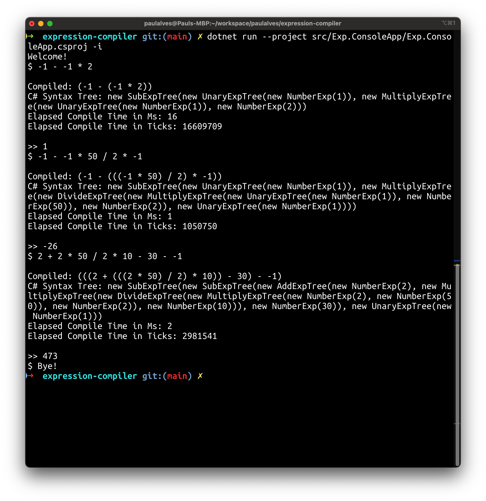

expression-compiler 

A simple expression compiler.

```csharp
    CompileAndRunFromSource("-2 + 1 * 3 * -5 / 2");

    CompileAndRunFromAst(
	new AddExpTree(
	    new UnaryExpTree(new NumberExp(2)),
	    new DivideExpTree(
		new MultiplyExpTree(
		    new MultiplyExpTree(
			new NumberExp(1),
			new NumberExp(3)),
		    new UnaryExpTree(new NumberExp(5))),
		new NumberExp(2))));
```

Outputs: 

```csharp
C# Syntax Tree: new AddExpTree(new UnaryExpTree(new NumberExp(2)), new DivideExpTree(new MultiplyExpTree(new MultiplyExpTree(new NumberExp(1), new NumberExp(3)), new UnaryExpTree(new NumberExp(5))), new NumberExp(2)))
Expression Tree: () => (-2 + (((1 * 3) * -5) / 2))
Result: -9.5

C# Syntax Tree: new AddExpTree(new UnaryExpTree(new NumberExp(2)), new DivideExpTree(new MultiplyExpTree(new MultiplyExpTree(new NumberExp(1), new NumberExp(3)), new UnaryExpTree(new NumberExp(5))), new NumberExp(2)))
Expression Tree: () => (-2 + (((1 * 3) * -5) / 2))
Result: -9.5
```
How to run

```shell
git clone https://github.com/paulalves/expression-compiler && cd expression-compiler
dotnet restore Exp.sln 
dotnet build Exp.sln 
dotnet run --project src/Exp.ConsoleApp/Exp.ConsoleApp.csproj -i 
```


